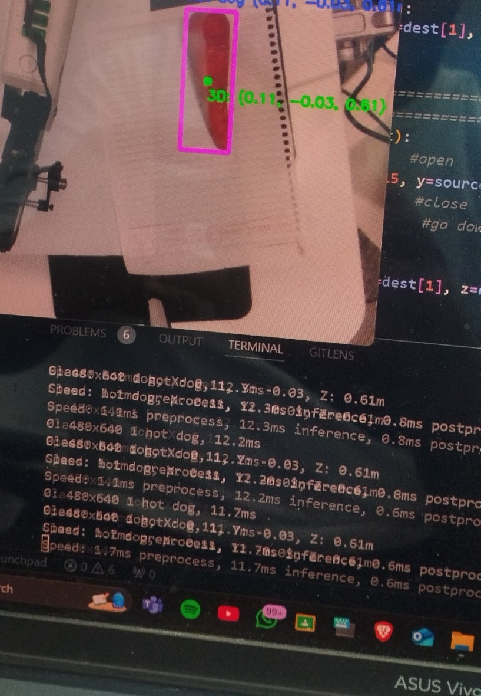
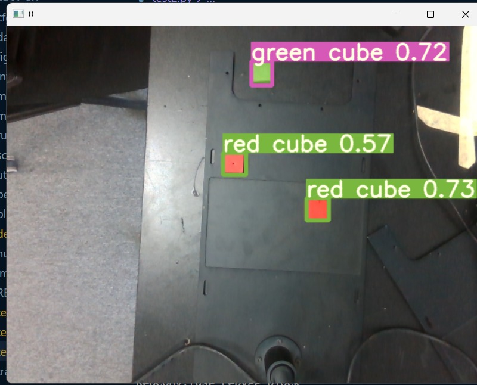

# Dobot Magician Pick and Place Project

This project implements a pick and place operation using a Dobot Magician robotic arm, combined with computer vision for object detection. The system uses a RealSense camera for 3D object detection and the Dobot Magician arm for pick and place operations.

## Project Structure

```
.
├── Dobot/                  # Dobot SDK and control files
│   ├── DoBotArm.py        # Main robot arm control class
│   ├── DobotControl.py    # Basic control functions
│   ├── DobotDllType.py    # Type definitions for Dobot SDK
│   ├── DobotM1.py         # M1 robot specific functions
│   ├── DobotMagician.py   # Magician robot specific functions
│   ├── DobotM1Pro.py      # M1Pro robot specific functions
│   ├── DobotMPro.py       # MPro robot specific functions
│   ├── DobotStudio.py     # Studio interface functions
│   ├── DobotType.py       # Common type definitions
│   └── DobotUtil.py       # Utility functions
├── main.py                # Main application entry point
├── calibration.py         # Camera-to-robot calibration module
├── calibration_data.npy   # Saved calibration data
├── detected_images/       # Directory for saving detection images
├── media/                 # Media files (images and GIFs)
│   ├── Realtime_detection.jpg
│   ├── Pick_and_place.gif
│   └── color_cubes_detection.jpg
├── train_yolov7.ipynb     # Jupyter notebook for training YOLOv7 model
└── requirements.txt       # Python dependencies
```

## Requirements

- Python 3.x
- Dobot Magician robotic arm
- Intel RealSense camera (D435 or similar)
- YOLOv10 for object detection
- Required Python packages (see requirements.txt)

## Installation

1. Clone this repository:
   ```bash
   git clone https://github.com/yourusername/dobot-pick-and-place.git
   cd dobot-pick-and-place
   ```

2. Install the required Python packages:
   ```bash
   pip install -r requirements.txt
   ```

3. Connect the Dobot Magician arm to your computer via USB

4. Connect the RealSense camera to your computer via USB

## Dobot SDK

The project includes the Dobot SDK in the `Dobot/` folder, which provides the necessary functions to control the Dobot Magician robotic arm. The SDK includes:

- **DoBotArm.py**: Main class for controlling the robot arm
- **DobotControl.py**: Basic control functions for the robot
- **DobotMagician.py**: Specific functions for the Magician robot model
- **DobotType.py**: Type definitions for the SDK
- **DobotUtil.py**: Utility functions for the SDK

The SDK is used by the `RobotController` class in `main.py` to control the robot arm.

## Object Detection Training

The project includes a Jupyter notebook (`train_yolov7.ipynb`) for training a YOLOv7 model for object detection. The notebook contains:

- Data preparation and augmentation
- Model configuration
- Training process
- Evaluation metrics
- Model export

### Custom Dataset Training
The project demonstrates training on a custom dataset of color cubes from Roboflow. The training process includes:
- Dataset preparation and annotation
- Model fine-tuning
- Performance evaluation
- Real-time detection testing

To train your own model:
1. Prepare your dataset in YOLO format
2. Open the notebook in Jupyter
3. Follow the instructions in the notebook to train the model
4. Export the trained model and update the model path in `DetectionConfig`

## Calibration

The project includes a calibration module (`calibration.py`) that handles the transformation between the camera's coordinate system and the robot's coordinate system. This calibration is essential for accurate pick and place operations.

### Calibration Process

1. The system defines corresponding points in both camera and robot coordinate systems
2. It calculates the affine transformation matrix between these points
3. The transformation matrix is saved to a file for use in the main application

### Running Calibration

You can run the calibration module directly to generate or update the calibration data:
```bash
python calibration.py
```

This will:
- Calculate the transformation matrix
- Save it to "calibration_data.npy"
- Demonstrate the transformation with an example point

## Usage

### Running the Main Application

To run the main application:
```bash
python main.py
```

The application will:
1. Initialize the camera and robot
2. Start detecting objects in the camera feed
3. When a target object (carrot or scissors) is detected, move the robot to pick it up
4. Place the object at a predefined location

### Configuration

You can modify the following parameters in the code:

- **Camera Configuration** (`CameraConfig` class in `main.py`):
  - Resolution, frame rate, and format settings

- **Detection Configuration** (`DetectionConfig` class in `main.py`):
  - Model path, target classes, confidence threshold
  - Output directory for detection images

- **Calibration Points** (`CameraRobotCalibrator` class in `calibration.py`):
  - Camera and robot coordinate points for calibration

## Features

- Object detection using YOLOv10
- 3D coordinate extraction from depth camera
- Camera-to-robot coordinate transformation
- Automated pick and place operations
- Real-time robot arm control
- Belt conveyor integration
- Comprehensive error handling and logging

## Media

Here are some visual aids to help you understand the project:

- **Real-time Detection**: 
- **Pick and Place Demo**: 
- **Color Cubes Detection**: 

These media files provide a visual overview of the project's functionality and setup.

## Troubleshooting

### Common Issues

1. **Camera not detected**:
   - Ensure the RealSense camera is properly connected
   - Check if the camera is recognized by your system

2. **Robot not responding**:
   - Verify the USB connection to the Dobot arm
   - Check if the Dobot SDK is properly installed

3. **Incorrect pick and place positions**:
   - Run the calibration process again to update the transformation matrix
   - Check if the calibration points are correctly defined

## License

This project is licensed under the MIT License - see the [LICENSE](LICENSE) file for details.

## Contributing

Contributions are welcome! Please feel free to submit a Pull Request. For major changes, please open an issue first to discuss what you would like to change.

1. Fork the repository
2. Create your feature branch (`git checkout -b feature/amazing-feature`)
3. Commit your changes (`git commit -m 'Add some amazing feature'`)
4. Push to the branch (`git push origin feature/amazing-feature`)
5. Open a Pull Request

Please make sure to update tests as appropriate and follow the existing code style. 